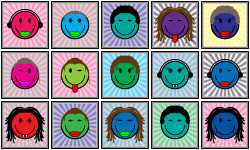

# Thank you to HashLips 👄

To find out more please visit his sites:

[Github](https://github.com/HashLips)

[📺 YouTube](https://www.youtube.com/channel/UC1LV4_VQGBJHTJjEWUmy8nA)

# HashLips Art Engine Cloned for the Happy Face Project🔥

Create unique generative art by using the canvas api and node js. Before you use the generation engine, make sure you have node.js installed.

Before installing node.js what worked for me (on 2020 M1 MacBook) was installing nvm first through CLI code, follow this instructions here:
https://dev.to/httpjunkie/setup-node-version-manager-nvm-on-mac-m1-7kl

## Installation/Troubleshooting for M1 Macs 🛠️

Check out this link: https://github.com/HashLips/hashlips_art_engine/issues/439
Scroll to the message from user "ezdouglas," it was the only thing that worked for me.  

Cheers!

